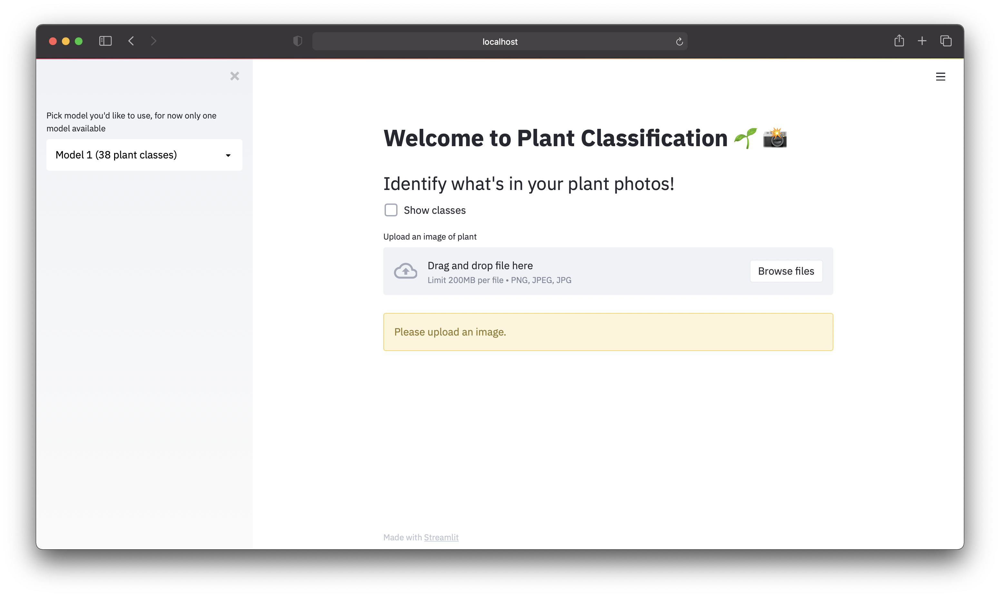

# plant-disease-classification-ui

plant-disease-classification-ui is a Streamlit-powered web application - Plant Vision Plant Classification 🌱 👁 - for classifying images of plants. Project uses a pre-trained ML model which you can find more details [here](https://github.com/abdullahselek/plant-disease-classification-pytorch). Web app runs locally making a classification on an image of plant.

## Requirements

- Python 3
- Modules listed on requirements.txt


## Installation

The code is hosted at https://github.com/abdullahselek/plant-disease-classification-ui

```bash
git clone git://github.com/abdullahselek/plant-disease-classification-ui.git
```

Change into the plant-disease-classification-ui directory and create a virtual environment then activate

```bash
cd plant-disease-classification-ui
python3 -m venv env
source env/bin/activate
```

To install dependencies

```bash
pip install -r requirements.txt
```

## Running

After completing installation you can run commands below

```bash
streamlit run plant_disease_classification_ui/app.py
```

App will be ready on http://localhost:8501


